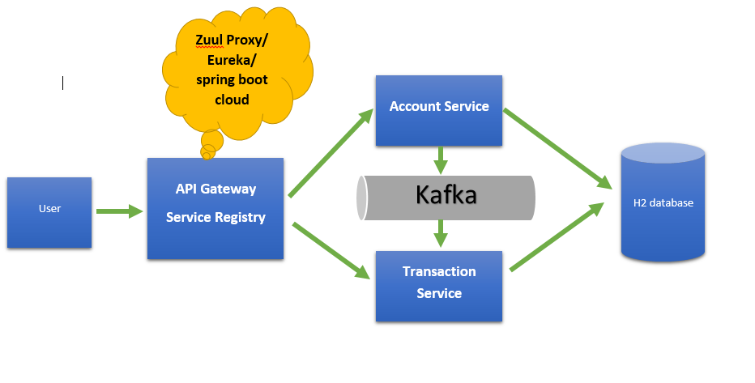

# banking-system

## To create a account

### Request

`POST http://localhost:8080/account/create`
'

	{
		
	"username":"johnsmith",
	"firstName":"dsds",
	"email":"HEllo@Worlf",
	"lastName":"John",
	"phoneNumber":"098923479237",
	"password":"johnsmith"
	
	
	}
'
## To initate a transaction

### Request
`POST http://localhost:8080/account/startTransaction`

	{
		"transactionType":"CREDIT",
		"amount":20
	}

transactionType can be either CREDIT or DEBIT

## To get account balance

### Request
`GET http://localhost:8080/account/details`

	{
		
	"username":"johnsmith",
	"firstName":"dsds",
	"email":"HEllo@Worlf",
	"lastName":"John",
	"phoneNumber":"098923479237",
	"balance":0
	
	
	}

